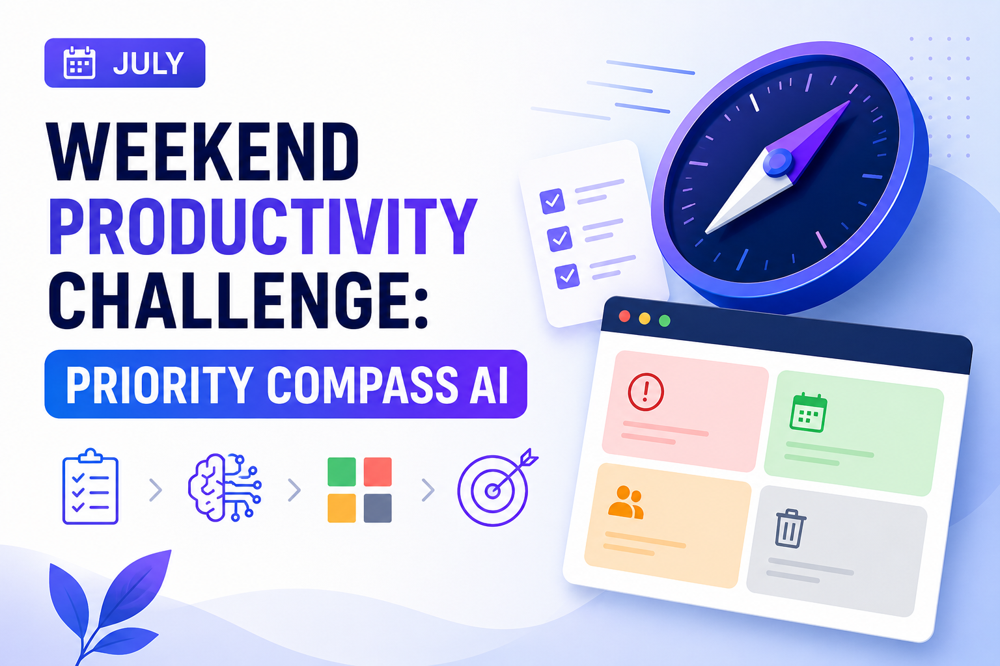
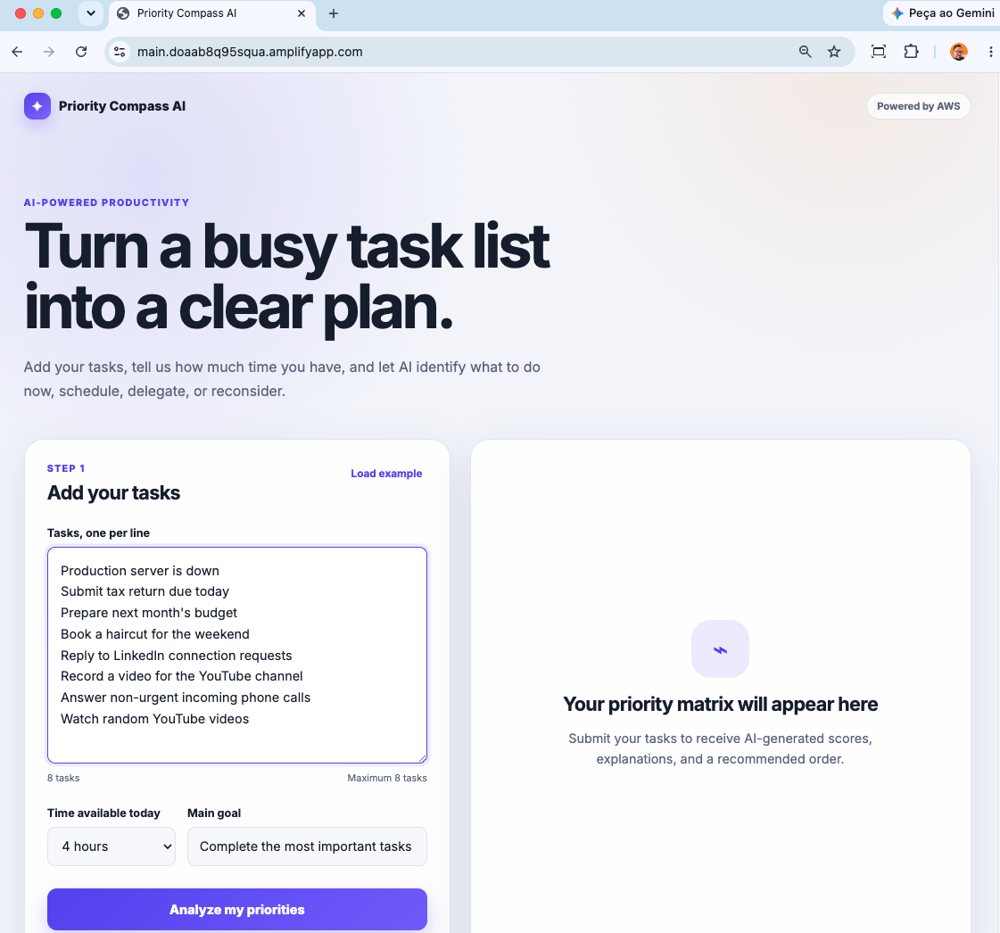
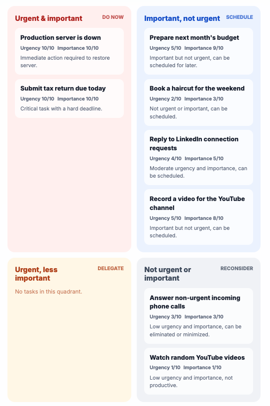
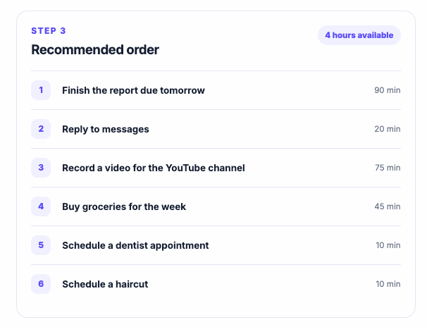
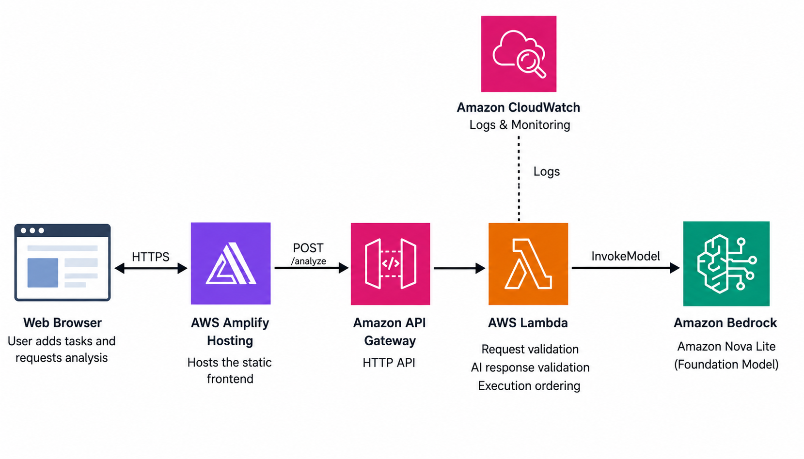
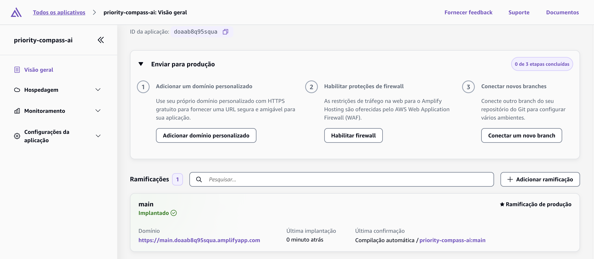
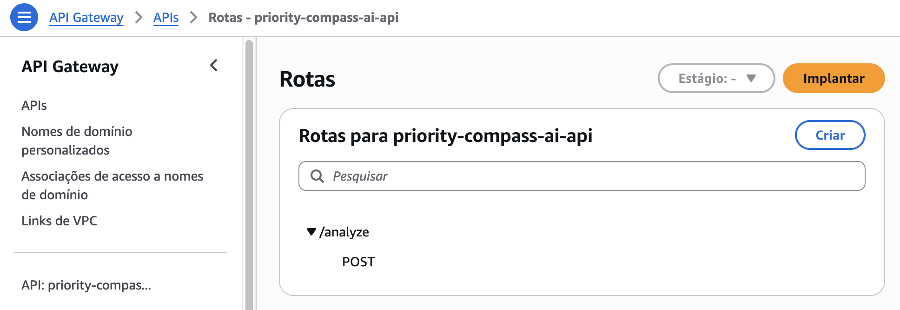
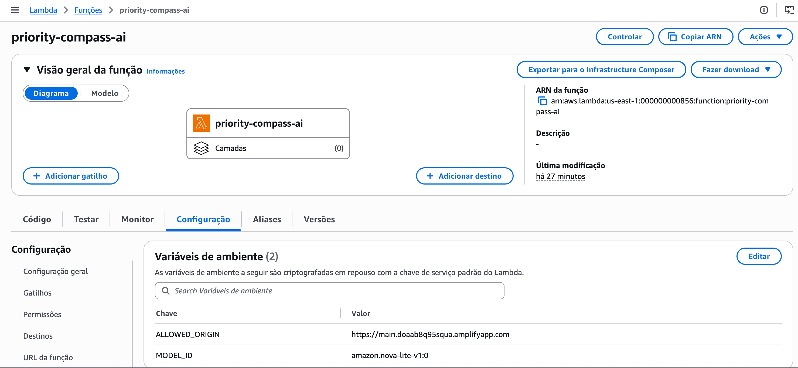
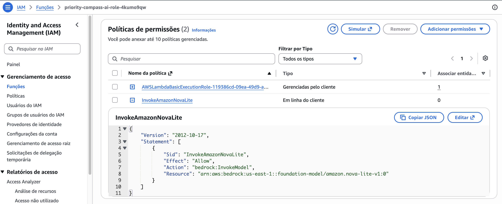

# Priority Compass AI

🌐 **Idioma:** [English](README.md) | **Português**




| Propriedade | Valor |
|---|---|
| Região AWS | us-east-1 |
| Modelo de IA | Amazon Nova Lite |
| Runtime | Python 3.13 |
| Arquitetura | arm64 |
| Frontend | HTML / CSS / JavaScript |
| Backend | AWS Lambda |
| API | Amazon API Gateway (HTTP API) |
| Hospedagem | AWS Amplify Hosting |

Aplicação de produtividade com inteligência artificial desenvolvida para o **AWS Weekend Productivity Challenge**.

O Priority Compass AI analisa uma lista de tarefas usando a Matriz de Eisenhower. A aplicação atribui pontuações de urgência e importância, classifica cada tarefa em um dos quatro quadrantes, explica o motivo de cada decisão e gera uma ordem recomendada de execução usando o Amazon Bedrock.

---

# Aplicação online

A aplicação foi implantada usando o AWS Amplify Hosting durante o desafio.

> **Observação**
>
> Para manter os custos da AWS o mais baixos possível, a aplicação online pode estar indisponível após o término do desafio. O código-fonte completo continua disponível neste repositório.

---

# Aplicação

## Entrada de tarefas



Os usuários podem inserir até **8 tarefas**, definir opcionalmente o tempo disponível e informar um objetivo principal antes de solicitar uma análise com IA.

---

## Matriz de prioridades gerada por IA



O Amazon Bedrock classifica cada tarefa em um dos quatro quadrantes da Matriz de Eisenhower:

- Urgente e importante
- Importante, mas não urgente
- Urgente, mas menos importante
- Nem urgente nem importante

Cada tarefa também recebe:

- Pontuação de importância
- Pontuação de urgência
- Explicação gerada por IA

---

## Ordem recomendada de execução



Depois de classificar todas as tarefas, a aplicação gera uma ordem recomendada de execução, acompanhada de uma breve explicação sobre por que cada tarefa deve ser realizada naquela sequência.

---

# Arquitetura



```text
Navegador
    │
    ▼
AWS Amplify Hosting
    │
    ▼
Amazon API Gateway (HTTP API)
    │
    ▼
AWS Lambda
    │
    ▼
Amazon Bedrock (Amazon Nova Lite)
```

O Amazon CloudWatch é usado para monitoramento e solução de problemas, enquanto o AWS Identity and Access Management (IAM) controla as permissões necessárias para a função Lambda.

| Camada | Serviço AWS |
|---|---|
| Frontend | AWS Amplify Hosting |
| API | Amazon API Gateway (HTTP API) |
| Backend | AWS Lambda |
| IA | Amazon Bedrock (Amazon Nova Lite) |
| Monitoramento | Amazon CloudWatch |
| Segurança | AWS IAM |

---

# Serviços AWS

### AWS Amplify Hosting

Hospeda a aplicação frontend estática.

### Amazon API Gateway

Fornece o endpoint público da API HTTP.

Responsável por:

- Encaminhar solicitações
- Limitar a taxa de requisições
- Configurar CORS

### AWS Lambda

Implementa a lógica do backend.

Responsabilidades:

- Validar as solicitações
- Validar os limites de tarefas
- Invocar o Amazon Bedrock
- Validar a resposta da IA
- Calcular a ordem de execução
- Retornar a resposta final

### Amazon Bedrock

Usa o **Amazon Nova Lite** para:

- Analisar tarefas
- Classificar prioridades
- Explicar decisões

### Amazon CloudWatch

Armazena os logs de execução da função Lambda para solução de problemas.

### AWS IAM

Fornece permissões com privilégio mínimo, permitindo que a função Lambda invoque apenas o modelo necessário do Amazon Bedrock.

---

# Configuração da AWS

## Implantação no AWS Amplify



O frontend é implantado automaticamente sempre que alterações são enviadas para a branch configurada no GitHub.

---

## Amazon API Gateway



A aplicação expõe um único endpoint:

```text
POST /analyze
```

---

## Variáveis de ambiente da função Lambda



Variáveis de ambiente:

```text
MODEL_ID=amazon.nova-lite-v1:0
ALLOWED_ORIGIN=https://YOUR_AMPLIFY_DOMAIN
```

Substitua `https://YOUR_AMPLIFY_DOMAIN` pela URL exata do seu AWS Amplify.

---

## Permissões do AWS IAM



A função de execução da Lambda contém uma política inline que permite invocar apenas o modelo Amazon Nova Lite.

---

# Estrutura do repositório

```text
priority-compass-ai/
├── index.html
├── styles.css
├── app.js
├── robots.txt
├── lambda/
│   └── lambda_function.py
├── images/
├── README.md
├── README.pt-BR.md
├── LICENSE
└── .gitignore
```

Os arquivos do frontend permanecem na raiz do repositório porque o AWS Amplify publica o diretório raiz.

---

# Pré-requisitos

Antes de implantar o projeto, certifique-se de ter:

- Uma conta AWS
- Amazon Bedrock habilitado
- Acesso ao modelo Amazon Nova Lite
- Git
- Python 3.13

> **Região**
>
> Este projeto foi desenvolvido e testado na região **Leste dos EUA (Norte da Virgínia)** (`us-east-1`).

---

# Implantação rápida

**Tempo estimado de implantação:** 15 a 20 minutos.

---

## 1. Criar o repositório no GitHub

Nome sugerido para o repositório:

```text
priority-compass-ai
```

Envie todos os arquivos do projeto para o repositório.

---

## 2. Implantar o frontend com o AWS Amplify

Crie uma aplicação no AWS Amplify.

Nome sugerido para a aplicação:

```text
priority-compass-ai
```

Conecte a aplicação ao seu repositório do GitHub.

Selecione a branch que deseja implantar.

Exemplo:

```text
main
```

Os arquivos do frontend permanecem na raiz do repositório.

Depois da implantação, copie o domínio do Amplify.

Exemplo:

```text
https://main.example123.amplifyapp.com
```

---

## 3. Criar a função Lambda

Crie uma função AWS Lambda usando a seguinte configuração.

Nome sugerido para a função:

```text
priority-compass-ai
```

Configuração:

```text
Runtime:
Python 3.13

Arquitetura:
arm64

Memória:
128 MB

Tempo limite:
10 segundos
```

Esses valores são suficientes para este projeto e ajudam a manter os custos da Lambda o mais baixos possível.

O código-fonte do backend está localizado em:

```text
lambda/lambda_function.py
```

Crie um arquivo ZIP contendo apenas:

```text
lambda_function.py
```

O arquivo deve estar na raiz do arquivo ZIP.

Envie o arquivo ZIP para a função Lambda.

Configure as seguintes variáveis de ambiente:

```text
MODEL_ID=amazon.nova-lite-v1:0
ALLOWED_ORIGIN=https://YOUR_AMPLIFY_DOMAIN
```

Substitua `https://YOUR_AMPLIFY_DOMAIN` pela URL exata do seu Amplify, sem barra no final.

Exemplo:

```text
ALLOWED_ORIGIN=https://main.example123.amplifyapp.com
```

---

## 4. Configurar o IAM

Abra a função Lambda e acesse:

```text
Configuração
→ Permissões
→ Função de execução
```

A função de execução geralmente possui um nome gerado semelhante a:

```text
priority-compass-ai-role-abc123
```

ou:

```text
AWSLambdaBasicExecutionRole-119386cd...
```

Clique no nome da função de execução para abri-la no AWS Identity and Access Management (IAM).

Escolha:

```text
Adicionar permissões
→ Criar política inline
```

Nome sugerido para a política:

```text
InvokeAmazonNovaLite
```

Crie uma política semelhante a esta:

```json
{
  "Version": "2012-10-17",
  "Statement": [
    {
      "Sid": "InvokeAmazonNovaLite",
      "Effect": "Allow",
      "Action": "bedrock:InvokeModel",
      "Resource": "arn:aws:bedrock:us-east-1::foundation-model/amazon.nova-lite-v1:0"
    }
  ]
}
```

Anexe essa política inline à **função de execução da Lambda**.

A função de execução também precisa das permissões padrão do CloudWatch Logs, que são criadas automaticamente pelo AWS Lambda.

---

## 5. Criar o Amazon API Gateway

Crie uma **HTTP API**.

Nome sugerido para a API:

```text
priority-compass-ai-api
```

Crie a rota:

```text
POST /analyze
```

Integre a rota à função Lambda:

```text
priority-compass-ai
```

Use o estágio padrão:

```text
$default
```

Habilite a implantação automática para o estágio `$default`.

---

## 6. Configurar o CORS

Configure o CORS com os seguintes valores:

```text
Access-Control-Allow-Origin:
https://YOUR_AMPLIFY_DOMAIN

Access-Control-Allow-Headers:
content-type

Access-Control-Allow-Methods:
POST

Access-Control-Expose-Headers:
Deixe vazio

Access-Control-Max-Age:
3600

Access-Control-Allow-Credentials:
Não
```

Substitua `https://YOUR_AMPLIFY_DOMAIN` pela URL exata do seu AWS Amplify.

Exemplo:

```text
https://main.example123.amplifyapp.com
```

Use o mesmo valor na variável de ambiente da Lambda:

```text
ALLOWED_ORIGIN=https://YOUR_AMPLIFY_DOMAIN
```

Nas HTTP APIs, o API Gateway trata automaticamente as solicitações de preflight do CORS. Não é necessário criar uma rota `OPTIONS`.

---

## 7. Configurar a limitação de requisições

Abra o estágio `$default`.

Configure a limitação de requisições para:

```text
POST /analyze
```

Valores sugeridos:

```text
Taxa:
1 solicitação por segundo

Pico:
2 solicitações
```

Esses valores fornecem proteção suficiente para uma demonstração pública sem comprometer a capacidade de resposta da aplicação.

---

## 8. Atualizar o frontend

Abra:

```text
app.js
```

Atualize o endpoint da API:

```javascript
const CONFIG = {
  apiUrl: "https://YOUR_API_ID.execute-api.us-east-1.amazonaws.com/analyze",
  timeoutMs: 60000
};
```

Faça o commit e envie as alterações.

O AWS Amplify implantará novamente a aplicação automaticamente após cada envio.

---

# Modo de demonstração

Se o arquivo `app.js` ainda contiver o valor:

```text
https://YOUR_API_ID.execute-api.us-east-1.amazonaws.com/analyze
```

a aplicação iniciará automaticamente em **Modo de Demonstração**.

Nesse modo:

- Nenhuma solicitação é enviada ao Amazon API Gateway.
- O Amazon Bedrock não é invocado.
- As tarefas são classificadas usando regras locais de exemplo.
- A interface e o fluxo da aplicação podem ser testados sem criar recursos na AWS.

O modo de demonstração serve apenas para apresentar o funcionamento da interface. Ele não interpreta o contexto das tarefas como um modelo de inteligência artificial.

Para habilitar a análise real com o Amazon Bedrock, substitua `YOUR_API_ID` pela URL do seu Amazon API Gateway.

---

# Executar localmente

Para visualizar o frontend antes de implantá-lo no AWS Amplify Hosting, inicie um servidor web local simples:

```bash
python3 -m http.server 8080
```

Depois, abra:

```text
http://localhost:8080
```

Se `YOUR_API_ID` não tiver sido substituído, a aplicação funcionará automaticamente no **Modo de Demonstração**.

Para realizar um teste completo com IA, atualize o endpoint em `app.js` para apontar para o Amazon API Gateway implantado.

---

# Dependências da Lambda

A função Lambda não exige pacotes Python externos.

O pacote de implantação precisa conter apenas:

```text
lambda_function.py
```

---

# Controles de custos e proteção contra abuso

Este projeto foi desenvolvido com dois objetivos principais:

- Manter os custos da AWS o mais baixos possível.
- Reduzir o uso abusivo enquanto a aplicação estiver disponível publicamente.

Os seguintes controles foram implementados:

- Amazon API Gateway HTTP API em vez de REST API.
- Limitação de requisições no API Gateway.
- Máximo de **8 tarefas** por solicitação.
- Validação do corpo da solicitação.
- Limite de 200 caracteres por tarefa.
- Validação de tarefas duplicadas no frontend.
- Validação do tamanho das tarefas.
- Origem CORS restrita.
- Validação da origem na função Lambda.
- Resistência a injeção de prompts.
- Temperatura baixa no Amazon Nova Lite.
- Limite de tokens na resposta do Bedrock.
- Validação da resposta da IA.
- Validação da estrutura da resposta da API no frontend.
- Ordenação determinística de execução na função Lambda.
- Nenhum banco de dados.
- Nenhum armazenamento persistente.
- Nenhuma simultaneidade provisionada.
- Nenhum conteúdo sensível das tarefas gravado nos logs do CloudWatch.

---

# Otimização de custos

Para minimizar os custos da infraestrutura, o **AWS Amplify Firewall** opcional foi desabilitado intencionalmente.

Embora o Amplify Firewall forneça proteção adicional por meio do AWS WAF, ele também adiciona cobranças mensais fixas e custos baseados em requisições.

Para este projeto de demonstração, os seguintes controles já oferecem um bom nível de proteção:

- Limitação de requisições no API Gateway.
- Origem CORS restrita.
- Validação da origem na função Lambda.
- Máximo de 8 tarefas por solicitação.
- Validação das solicitações.
- Validação do tamanho da carga útil.
- Validação da resposta da IA.
- Limitação da saída do Bedrock.
- Permissões IAM com privilégio mínimo.
- Nenhum armazenamento persistente.

Esses controles reduzem significativamente o uso abusivo e mantêm os custos operacionais próximos de zero.

> **Recomendação para produção**
>
> Para cargas de trabalho de produção expostas a um grande público, considere habilitar o AWS WAF, por meio do AWS Amplify Firewall ou diretamente na frente do Amazon API Gateway. Considere também implementar autenticação, planos de uso, monitoramento e mecanismos adicionais de limitação de requisições.

---

# Observações de segurança

Os itens abaixo são públicos e **não são credenciais da AWS**:

- URL do AWS Amplify
- Endpoint do Amazon API Gateway

Nunca envie para o repositório:

- AWS Access Keys
- AWS Secret Access Keys
- AWS Session Tokens
- Credenciais do IAM
- Certificados privados
- Informações de cobrança
- Arquivos `.env` contendo segredos
- Arquivos privados de configuração
- Logs do CloudWatch contendo informações sensíveis

---

# Nomes dos recursos

Os nomes abaixo são sugeridos ao longo deste projeto.

| Recurso | Nome sugerido |
|---|---|
| Repositório no GitHub | `priority-compass-ai` |
| Aplicação do AWS Amplify | `priority-compass-ai` |
| Função AWS Lambda | `priority-compass-ai` |
| Política inline do IAM | `InvokeAmazonNovaLite` |
| Amazon API Gateway | `priority-compass-ai-api` |
| Rota da API | `POST /analyze` |
| Estágio da API | `$default` |
| Grupo de logs da Lambda | `/aws/lambda/priority-compass-ai` |
| Variável de ambiente | `MODEL_ID` |
| Variável de ambiente | `ALLOWED_ORIGIN` |
| Tag da release no GitHub | `v1.0.0` |
| Título da release no GitHub | `Priority Compass AI v1.0` |

A função de execução do IAM normalmente é criada automaticamente pela AWS e, por isso, pode ter um nome gerado.

---

# Destaques do projeto

- Priorização de tarefas com IA usando a Matriz de Eisenhower.
- Arquitetura serverless.
- Integração com o Amazon Bedrock usando o Amazon Nova Lite.
- Projeto orientado à redução de custos.
- Abordagem de segurança com várias camadas de validação.
- Processo de implantação totalmente documentado.
- Repositório público no GitHub.
- Projeto desenvolvido para ser reproduzido em outros desafios da comunidade AWS.
- Modo de demonstração local sem dependência de recursos AWS.
- Validação de respostas e tratamento de erros no frontend.
- Melhorias de acessibilidade, incluindo `aria-busy` e suporte a `prefers-reduced-motion`.

---

# Licença

Este projeto está licenciado sob a licença MIT.
